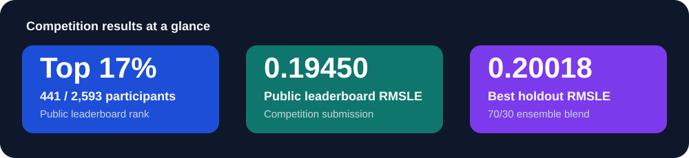
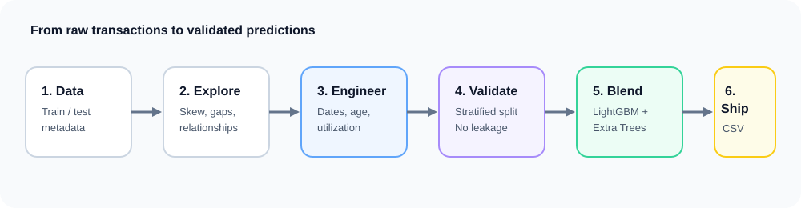
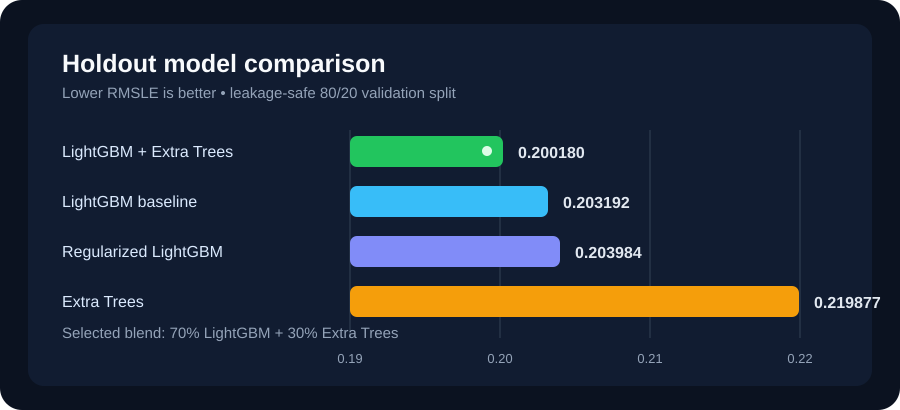

# Heavy Equipment Selling Price Prediction

End-to-end machine learning solution for Kaggle's **Heavy Equipment Selling Price Prediction Challenge**. The project predicts auction selling prices (`TargetValue`) for used heavy equipment from historical transaction, machine, specification, usage, and regional data.



## Highlights

- **Top 17% on the public leaderboard:** ranked **441st of 2,593 participants** (AbhayRawat).
- **Public leaderboard RMSLE:** **0.19450**.
- **Best leakage-safe holdout RMSLE:** **0.20018**, achieved with a 70/30 LightGBM + Extra Trees blend.
- Built a reproducible, end-to-end notebook: EDA, validation design, feature engineering, model selection, ensembling, and Kaggle submission generation.

> **CV / résumé bullet:** Achieved a top-17% finish (441/2,593) in Kaggle's Heavy Equipment Selling Price Prediction Challenge by building a leakage-safe tabular regression ensemble; delivered a 0.19450 public-leaderboard RMSLE using engineered temporal, age, utilization, and equipment-specification features.

## Competition and problem

The challenge is a supervised regression problem: estimate the selling price of each unseen heavy-equipment transaction. Training data includes the target `TargetValue`; test data has the same descriptive fields but omits the price. Predictions are submitted as `TransactionID, TargetValue`.

The solution is evaluated with **Root Mean Squared Logarithmic Error (RMSLE)**:

```text
RMSLE = sqrt(mean((log(1 + prediction) - log(1 + actual))²))
```

RMSLE emphasizes proportional error rather than raw-currency error, which is useful when equipment prices span a wide range. The project therefore trains models on `log1p(TargetValue)` and transforms predictions back with `expm1` before creating the submission.

Competition page: [Kaggle overview](https://www.kaggle.com/competitions/heavy-equipment-selling-price-prediction-challenge/overview)

## What I built



The notebook, [`heavy_equipment_price_prediction.ipynb`](heavy_equipment_price_prediction.ipynb), implements the full ML workflow:

1. Loads Kaggle's `train.csv`, `test.csv`, `metadata.csv`, and sample submission.
2. Performs EDA of price skew, missingness, feature cardinality, machine age, and operational hours.
3. Creates a stratified 80/20 holdout split using target quantiles on the log-price scale.
4. Fits preprocessing rules on the training fold only, then applies them consistently to validation and test data.
5. Trains and compares LightGBM variants and Extra Trees.
6. Selects ensemble weights against the holdout RMSLE.
7. Refits the selected models on all labelled data and exports a validated Kaggle submission.

## Feature engineering and data quality

`HeavyEquipmentPreprocessor` centralizes preprocessing and helps prevent leakage. It removes near-empty columns (at least 99.5% missing), preserves a consistent feature schema, represents missing categorical values explicitly, and engineers:

- Transaction year, month, quarter, day of week, and day of year
- **Machine age**, computed at the date of sale and clipped to a realistic range
- `log1p(OperationalHoursMeter)` to reduce utilization skew
- Hours per machine year
- Full-descriptor length, digit count, and letter count
- Row-level missing-value count

LightGBM receives categorical features as categoricals; Extra Trees uses a fitted median/mode-imputation and ordinal-encoding pipeline. This allows each learner to use an appropriate representation while keeping validation isolated from fitting decisions.

## Modelling approach



| Model | Validation RMSLE |
| --- | ---: |
| LightGBM baseline | 0.203192 |
| Regularized LightGBM | 0.203984 |
| Extra Trees | 0.219877 |
| **LightGBM + Extra Trees ensemble** | **0.200180** |

The selected blend uses **70% LightGBM and 30% Extra Trees**. The ensemble improved over the standalone LightGBM baseline because the two tree-based approaches make partly different errors. Early stopping chose LightGBM's best iteration at **4,621** rounds on the holdout set.

The strongest LightGBM signals included detailed equipment specifications (`Spec_FullDescriptor`), regional market context (`RegionCode`), transaction timing, machine age, manufacture year, and operating hours.

## Results

| Measure | Result |
| --- | ---: |
| Public leaderboard RMSLE | **0.19450** |
| Public leaderboard rank | **441 / 2,593** |
| Percentile | **Top 17%** |
| Best holdout RMSLE | **0.20018** |
| Final test rows submitted | 15,000 |

The leaderboard score and holdout result measure different partitions, so they should be reported separately. The close scores indicate that the validation design provided a useful estimate while retaining strict separation between development and competition test data.

## Reproducibility

The notebook was authored for a Kaggle notebook environment. Attach the competition data through Kaggle, then run all cells. It expects:

```text
/kaggle/input/competitions/heavy-equipment-selling-price-prediction-challenge/
├── train.csv
├── test.csv
├── metadata.csv
└── sample_submission.csv
```

Main Python packages: `numpy`, `pandas`, `matplotlib`, `seaborn`, `scikit-learn`, and `lightgbm`.

The final submission is written to `/kaggle/working/new_ML_project_submission.csv` and checked for transaction-ID alignment, missing predictions, and non-negative prices.

## Repository contents

```text
.
├── heavy_equipment_price_prediction.ipynb  # Complete Kaggle solution
├── README.md                               # Project documentation
└── .gitignore                              # Ignores data, outputs, and notebook checkpoints
```

## Notes

- The competition data is not committed to this repository. Obtain it directly through Kaggle under the competition's terms.
- `RandomState = 42` is used throughout where applicable to make split and model behavior reproducible.
- The notebook's public-leaderboard score is recorded from the submitted competition result.
